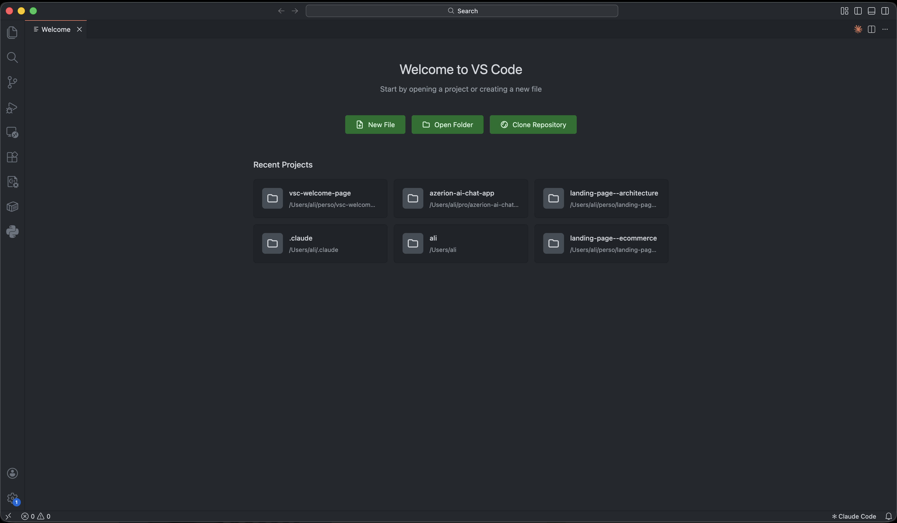

# Custom Welcome Page

A VS Code extension that replaces the default welcome page with a clean, customizable view showing your recent projects in a grid layout.

## Features

- **Recent Projects Grid** - Quickly access your recent projects with a single click
- **Theme Aware** - Automatically matches your VS Code theme (light/dark)
- **Quick Actions** - New File, Open Folder, and Clone Repository buttons
- **Configurable** - Adjust the number of projects displayed

## Configuration

| Setting | Description | Default |
|---------|-------------|---------|
| `customWelcome.maxProjects` | Maximum number of recent projects to display | 24 |

## Usage

The welcome page appears automatically when you open VS Code without a folder. You can also open it manually:

1. Press `Cmd+Shift+P` (Mac) or `Ctrl+Shift+P` (Windows/Linux)
2. Type "Show Custom Welcome Page"
3. Press Enter

## Author

Ali Madjaji

## License

MIT License - see [LICENSE](LICENSE) for details.
